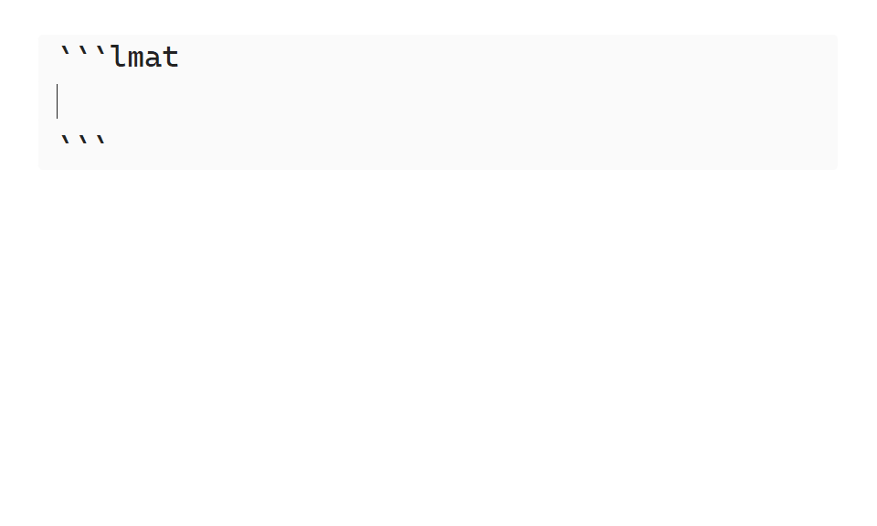

<div align="center">

  <h1 align="center">

  LaTeX Math (Smart Solve fork)

  </h1>

</div>

**LaTeX Math (Smart Solve fork)** is an [Obsidian](https://obsidian.md/) plugin that adds mathematical evaluation of LaTeX math blocks to your notes, using [Sympy](https://www.sympy.org).

This is a fork of [zarstensen/obsidian-latex-math](https://github.com/zarstensen/obsidian-latex-math) (the upstream **LaTeX Math** plugin). The fork keeps every upstream command and adds **Smart Solve**: a single notebook-style hotkey that reads your math blocks like a Python REPL session — defining variables, solving equations, accumulating constraints, and evaluating expressions — with section-scoped contexts so variable names can be reused across parts of a document.

Plugin id: `latex-math-smart-solve` · current version: `1.5.8`


Demo GIFs are inherited from upstream and use the upstream [recommended hotkeys](#command-list).[^gifs-note]

[^gifs-note]: All demo GIFs were produced with the [Obsidian Latex Suite](https://github.com/artisticat1/obsidian-latex-suite) plugin installed.

## Usage

Place the cursor inside any math block (display `$$...$$` or single-line inline `$...$`) and run **`Smart Solve LaTeX expression`** (recommended hotkey `Alt + B`). Smart Solve figures out what the block *means* and does the right thing:

- `$x = 3$` — defines `x` as `3`.
- `$x + 1 = 5$` — solves for `x` and overrides the previous value (`x = 4` now).
- `$x + y = 10$` — stores a constraint; once enough equations accumulate, values are derived automatically.
- `$3x + 2$` — evaluates the expression with everything defined so far and writes the result inline after a `⇒` marker.
- `$x^2 = 9$` — picks a solution by a deterministic tiebreaker and warns you about the alternatives.

All the explicit upstream commands (Evaluate, Solve, Expand, Factor, units, truth tables, …) are still available — see the [command list](#command-list). The [docs folder](docs/) covers everything in more depth, and [design_docs.md](design_docs.md) describes the Smart Solve design in detail.

<!-- omit in toc -->
## Table of Contents

- [Usage](#usage)
- [Command List](#command-list)
- [Features](#features)
  - [Smart Solve](#smart-solve)
  - [Evaluate](#evaluate)
  - [Solve](#solve)
  - [Symbol and Function Definitions](#symbol-and-function-definitions)
  - [Units and Physical Constants](#units-and-physical-constants)
  - [Symbol Assumptions](#symbol-assumptions)
  - [Logical Propositions](#logical-propositions)
  - [Convert To Sympy Code](#convert-to-sympy-code)
- [Settings](#settings)
- [Installing](#installing)
- [Contributing](#contributing)
- [License](#license)

## Command List

Below is a table of all the commands this plugin provides, along with a brief description and optionally a recommended hotkey.

| Command                                            | Recommended Hotkey | Usage                                                                                                                                              |
| -------------------------------------------------- | :----------------: | -------------------------------------------------------------------------------------------------------------------------------------------------- |
| Smart Solve LaTeX expression                       |     `Alt + B`      | Notebook-style dispatch: define, solve, verify, or evaluate the current section's math blocks based on their structure. See [Smart Solve](#smart-solve). |
| Evaluate LaTeX expression                          |                    | Evaluate the right most expression in a relation and simplify the result.                                                                          |
| Evalf LaTeX expression                             |     `Alt + F`      | Evaluate expression and output decimal numbers instead of fractions in the result.                                                                 |
| Expand LaTeX expression                            |     `Alt + E`      | Evaluate expression and expand the result as much as possible.                                                                                     |
| Factor LaTeX expression                            |                    | Evaluate expression and factorize the result as much as possible.                                                                                  |
| Partial fraction decompose LaTeX expression        |                    | Evaluate expression and perform partial fraction decomposition on the result.                                                                      |
| Solve LaTeX expression                             |     `Alt + L`      | Solve a single equation or a system of equations explicitly, choosing the variable(s) to solve for. Output goes in a new math block below.         |
| Convert units in LaTeX expression                  |     `Alt + U`      | Try to convert the units in the right most expression to the user supplied one.                                                                    |
| Create truth table from LaTeX expression (Markdown)|                    | If the expression is a proposition, insert a truth table as a markdown table.                                                                      |
| Create truth table from LaTeX expression (LaTeX)   |                    | If the expression is a proposition, insert a truth table as a LaTeX array.                                                                         |
| Convert LaTeX expression to Sympy                  |                    | Convert entire expression to its equivalent Sympy code, and insert the result in a code block below the current math block.                        |

## Features

### Smart Solve

Smart Solve is the fork's flagship feature: one hotkey that dispatches to the right operation based on the structure of each math block, with notebook-style implicit variable management.

**How a press works.** Each press re-evaluates the *entire current section* in one batch: every math block from the most recent section divider down is sent to the CAS in document order, and the implicit context (definitions and constraints) is rebuilt from scratch by replaying them. There is no hidden state — what you see in the document *is* the state.

**Dispatch rules**, per block:

- **`x = 3` (one unknown):** solve for it and store the value. A later equation may override an earlier value — the most recent derivation wins, like re-assigning a variable in a REPL. Overrides that change a value emit an info notice (`Overriding x: was 3, now 4`).
- **`x + y = 10` (several unknowns):** known symbols are substituted, then the equation joins the accumulated constraint system. Whenever the system uniquely determines some variables, they are promoted to definitions (`Derived: y = 7` notices); underdetermined ones stay free.
- **`3x + 2` or `3x + 2 =` (expression):** substitute all definitions and evaluate. The result is written inline after a configurable marker (default `\Rightarrow`). If symbols remain unknown but appear in stored constraints, Smart Solve substitutes what the constraints determine and returns a *symbolic* result, listing the remaining free parameters.
- **All symbols already defined:** the equation is treated as a verification — silent if true, a `Contradiction` error notice if false.
- **Multiple solutions** (`x^2 = 9`): if the prior value of `x` matches one solution it is kept silently; otherwise a deterministic tiebreaker picks (largest magnitude, then positive real > negative real > complex) and a warning lists all solutions. All solution candidates are retained internally until one is actually needed in a calculation. Solutions are also filtered by [symbol assumptions](#symbol-assumptions), so a `positive` symbol only takes the positive root.

**Section scoping.** The context resets at every markdown heading, horizontal rule (`---`, `***`, `___`), and `lmat` code block. Variables in one section never leak into another, so `x` can mean different things in different sections of the same note.

**Reference blocks.** Tag a block with a `%ref` LaTeX comment (also `% ref` / `% \text{ref}`) to mark it as documentation only — Smart Solve ignores it completely.

**Ignored blocks.** Put a `<!-- lmat:ignore -->` HTML comment immediately before a math block to opt that block out of **every** LaTeX Math command (not just Smart Solve). The block still renders normally as math, the comment stays invisible in preview, and you can keep writing prose on the same line. Unlike `%ref`, an explicit command run on an ignored block aborts with a notice instead of evaluating it, and Smart Solve never sends the block to the CAS (so it contributes no definitions or constraints). A stale plugin result on a newly-ignored block is stripped on the next Smart Solve press.

**Result markers.** Results are inserted as `source ⇒ result` inside the block. Re-pressing replaces the existing result instead of appending (idempotent). The insertion marker is configurable in [settings](#settings); detection is liberal and recognizes common arrows (`\Rightarrow`, `\to`, `\implies`, …) regardless of the setting, so old notes keep working. A trailing `\text{...}` suffix after a result (e.g. a unit annotation or comment) is preserved across refreshes.

**Refresh semantics.** Only the block under the cursor gets a *new* marker; all other blocks in the section are refresh-only — their existing results are updated (or stripped, if the block no longer produces a display result), but no new markers are added. Pressing the hotkey with the cursor outside any math block refreshes the whole section without adding anything.

**Interruption.** Long-running CAS work surfaces a clickable `evaluating` status-bar item after about a second; click it to interrupt all in-flight evaluations.

**Notices.** All feedback (overrides, multiple solutions, contradictions, errors) arrives as Obsidian notices — the document text is never used for error output. At most 5 notices are shown per press, with a rollup for the rest, plus a one-line summary (`Re-evaluated 3/5 blocks — 1 error`).

**Numeric display.** Numeric results are rendered to a configurable number of significant figures (default 3, override per document with `[render] sig_figs` in an `lmat` block), switching to scientific notation outside the range 10⁻⁴–10⁶. Values are always *stored* symbolically (`1/3` stays `1/3` internally), so precision is never lost. Non-numeric results stay symbolic.

> [!NOTE]
> Smart Solve currently handles one relation per math block — `cases`/`align` systems are rejected with an error notice (use the explicit [Solve](#solve) command for those), and function definitions like `f(x) = x^2` inside a Smart Solve block are ignored (use [`:=` definitions](#symbol-and-function-definitions) instead).

### Evaluate

Evaluate equations in various ways using the evaluate command suite. The computed output varies, depending on the chosen command.

The entire evaluate suite consists of the following commands: `Evaluate LaTeX expression`, `Evalf LaTeX expression`, `Expand LaTeX expression`, `Factor LaTeX expression` and `Partial fraction decompose LaTeX expression`.


### Solve

Solve equations explicitly using the `Solve LaTeX expression` command. Unlike Smart Solve, this command lets you pick which variable(s) to solve for, and outputs the solution in a new math block below the current one.
To solve a system of equations, place them in a `align` or `cases` environment, separated by latex newlines (`\\`).

The solution domain can be restricted for single equations in the solve equation modal, see the [relevant Sympy documentation](https://docs.sympy.org/latest/modules/sets.html#module-sympy.sets.fancysets) for a list of possible values.[^lmat-solve-domain]
Restrict the solution domain of a system of equations with [symbol assumptions](#symbol-assumptions) on the free symbols.

[^lmat-solve-domain]: The default solution domain for single equations can be set via the `domain` key in the `solve` table in an `lmat` environment. This same key sets the Smart Solve solution domain.


### Symbol and Function Definitions

Define values of symbols or functions using the `:=` operator.
Only one symbol or function can be defined per math block.

Definition persistence is location-based: any math block below a definition will use it; others will ignore it. Furthermore, all definitions are reset after an `lmat` code block.

To undefine a symbol or function, leave the right-hand side of the `:=` operator blank.

With Smart Solve, plain `=` equations also define variables implicitly — `:=` remains the explicit form, and is the only way to define *functions*.


### Units and Physical Constants

Denote units or physical constants in equations by surrounding them with braces `{}`.
LaTeX Math automatically handles conversions between units, constants and their various prefixes. See the [syntax](docs/SYNTAX.md#supported-units) document for a list of supported units and physical constants.

### Symbol Assumptions

Use an `lmat` code block to tell **LaTeX Math** about various assumptions it may make about specific symbols. This is used to further simplify expressions, such as roots, or limit the solution domain of equations. By default, all symbols are assumed to be complex numbers.

`lmat` code blocks make use of the [TOML](https://toml.io) config format. To define assumptions for a symbol, assign the symbol's name to a list of assumptions LaTeX Math should make, under the `symbols` table. Like definitions, an `lmat` code block's persistence is based on its location — and for Smart Solve, an `lmat` block also starts a new section. See below the demo GIF for a simple static `lmat` code block example.



> [!TIP]
> **Example**
>
> ````text
> ```lmat
> [symbols]
> x = [ "real", "positive" ]
> y = [ "integer" ]
>
> [solve]
> domain = "Reals"
>
> [render]
> sig_figs = 4
> ```
> ````

You can read more about **LaTeX Math** environments and the `lmat` code block [in the docs](docs/LMAT_ENV.md).

See the [Sympy documentation](https://docs.sympy.org/latest/guides/assumptions.html#id28) for a list of possible assumptions.

### Logical Propositions

Simplify logical propositions using the [evaluate commands](#evaluate). Truth tables can be generated from a logical proposition using the `Create truth table from LaTeX expression` commands.

See [SYNTAX.md/Logical Operators](docs/SYNTAX.md#logical-operators) for a list of logical operators.

> [!TIP]
> Want to check if two expressions are equal?
>
> Put an `\iff` in between them and upon [evaluation](#evaluate), **LaTeX Math** will insert `True` if they are symbolically equal or otherwise `False` if they are not.

### Convert To Sympy Code

Quickly convert LaTeX to Sympy code to perform more advanced computations using the `Convert LaTeX expression to Sympy` command.
This will insert a python code block containing the equivalent Sympy code of the selected math block.

## Settings

| Setting                    | Default       | Description                                                                                                                                                  |
| -------------------------- | ------------- | ------------------------------------------------------------------------------------------------------------------------------------------------------------ |
| Smart Solve result marker  | `\Rightarrow` | LaTeX inserted between the source and the result when Smart Solve writes a display result (e.g. `\to`, `\implies`). Empty restores the default `\Rightarrow`. Detection of existing markers is independent of this setting. |
| Developer mode             | off           | Use the Python source files and a local venv instead of the bundled executable. Requires reloading Obsidian. See [CONTRIBUTING](docs/CONTRIBUTING.md).        |

## Installing

This fork is **not** in the Obsidian community plugin catalog (the upstream plugin is, under the id `latex-math`). Install the fork via one of:

### BRAT Installation (easy)

- Make sure the [BRAT plugin](https://obsidian.md/plugins?id=obsidian42-brat) is installed in your obsidian vault.
- Run the `BRAT: Plugins: Add a beta plugin for testing (with or without version)` command via the command palette.
- Paste this repository's link in the `Repository` text field.
- Select the desired version in the `version` dropdown.
- Press the `Add plugin` button.

### Manual Installation

- Download the `plugin.zip` file from the desired release of this repository.
- Extract it to your vault's plugin folder, commonly located at `.obsidian/plugins`, relative to your vault's path.

The plugin is desktop-only (it spawns a local Python CAS process).

## Contributing

See [CONTRIBUTING](docs/CONTRIBUTING.md)

## License

See [LICENSE](LICENSE)
